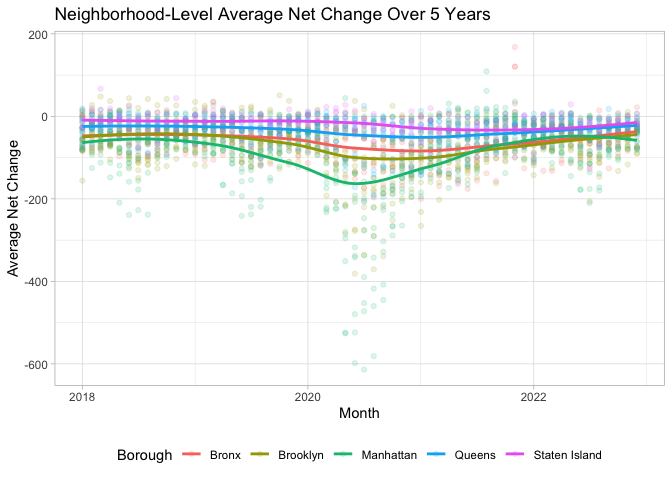

p8105_midterm_xl3214
================
Xuan Lu
2023-10-19

## Raw Data Overview and Report Goal

The goal of this project is to analyze ZIP code-level population changes
in New York City (NYC) using the USPS Change of Address (COA) dataset
and ZIP code data. By employing data cleaning, tidying, merging, and
exploratory data analysis (EDA) techniques, we aim to gain a
comprehensive understanding of the trends and patterns in population
changes across NYC’s boroughs and neighborhoods over a five-year period.
Our objective is to identify neighborhoods and boroughs that have
experienced significant population shifts, investigate data quality
issues, and provide insights into potential demographic trends driving
these changes. Through the project’s deliverables, we seek to contribute
valuable insights into address change patterns, demographic dynamics,
and the quality of the dataset, addressing its limitations and
highlighting opportunities for further analysis and research.

The raw USPS Change of Address NYC dataset has 5 variables and 11845
observations. The raw Zip Codes dataset has 7 variables and 324
observations.

## Data Cleaning, Tidying, Combining and Merging

``` r
# Define file paths and read data from Excel and CSV files
file_path <- "USPS CHANGE OF ADDRESS NYC.xlsx"
sheet_names <- excel_sheets(file_path)
data_frames <- lapply(sheet_names, function(sheet_name) {
  read_excel(file_path, sheet = sheet_name)
})

# Combine COA data, clean column names, and create new columns
coa <- bind_rows(data_frames) |>
  clean_names() |>
  rename(zip_code = zipcode) |>
  mutate(year = year(month)) |>
  mutate(net_change = total_perm_in - total_perm_out)

# Read ZIP code data from CSV, clean column names, and add a 'borough' variable
zip <- read.csv("Zip Codes.csv") |> 
  janitor::clean_names() |> 
  mutate(borough = county_name)

# Compare COA and ZIP data using joins
test1 <- anti_join(coa, zip, by = "zip_code") # 0 observations of 7 variables
test2 <- left_join(coa, zip, by = "zip_code") # 12085 observations of 14 variables
test3 <- right_join(coa, zip, by = "zip_code") # 12168 observations of 14 variables
test4 <- inner_join(coa, zip, by = "zip_code") # 12085 observations of 14 variables
test5 <- full_join(coa, zip, by = "zip_code") # 12168 observations of 14 variables

# Proceed with left_join to include only COA records in the final dataset
rm(test1, test2, test3, test4, test5)

# Merge COA and ZIP data, address many-to-many relationship warning
tidy <- left_join(coa, zip, by = "zip_code")
# Warning: Detected an unexpected many-to-many relationship between `x` and `y`.
# Need to go back and edit the codes to keep a one-to-many relationship between COA and ZIP.

# Check for duplicated combinations of month and zip_code in COA dataset
coa_duplicated <- coa |>
  group_by(month, zip_code) |>
  filter(duplicated(month, zip_code))
print(coa_duplicated)
# No duplicated combinations of month and zip_code in COA dataset.

# Check for duplicated combinations of zip_code and neighborhood in ZIP dataset
zip_duplicated <- zip |>
  group_by(zip_code, neighborhood) |>
  filter(duplicated(zip_code, neighborhood))
print(zip_duplicated)
# Four duplicated combinations of zip_code and neighborhood in COA dataset: 10463, 11201, 11239, 11693
zip |> filter(zip_code %in% c(10463, 11201, 11239, 11693))

# Update 'borough' variable to fix duplicates
unique(pull(zip, county_name))
zip <- zip |> 
  mutate(borough = ifelse(county_name == "Kings", "Brooklyn",
                          ifelse(county_name == "Richmond", "Staten Island",
                                 ifelse(county_name == "New York", "Manhattan", borough))))
unique(pull(zip, borough))

# Fix duplicates of zip codes 10463, 11201, 11239, and 11693
zip <- zip |> 
  mutate(
    county_name = case_when(
      zip_code == 10463 ~ "Bronx", # Code 10463 as Bronx county
      zip_code %in% c(11201, 11239) ~ "Kings", # Code 11201 and 11239 as Kings county
      zip_code == 11693 ~ "Queens", # Code 11693 as Queens county
      TRUE ~ county_name),  # Leave other rows as they are
    borough = case_when(
      zip_code %in% c(11201, 11239) ~ "Brooklyn",
      TRUE ~ borough))  # Leave other rows as they are

# Delete duplicates based on zip_code
zip <- zip |>
  distinct(zip_code, .keep_all = TRUE)
# Checking for duplicates one last time
zip |> filter(zip_code %in% c(10463, 11201, 11239, 11693))

# Merge COA and ZIP data, retaining 'city' variable for data quality check
tidy <- left_join(coa, zip, by = "zip_code")

# Check for NAs in 'neighborhood' in both ZIP and tidy datasets
zip |> filter(is.na(neighborhood)) # 142 NAs in neighborhood variable in ZIP dataset
tidy |> filter(is.na(neighborhood)) # 1288 NAs in neighborhood variable in tidy dataset

# Retain 'city' variable to investigate potential data quality issues
summary(tidy)

# List of objects to keep
objects_to_keep <- c("coa", "zip", "tidy")

# Get a list of all objects in the current environment
all_objects <- ls()

# Find objects to remove
objects_to_remove <- setdiff(all_objects, objects_to_keep)

# Remove objects to be deleted
rm(list = objects_to_remove)
rm(objects_to_remove, all_objects)
```

The logic followed to clean the datasets is as follows:

1.  Data is read from Excel and CSV files, combining the “COA” data and
    “ZIP” code data.

2.  Column names are cleaned and new columns, such as “year” and
    “net_change,” are created in the “COA” dataset.

3.  The “ZIP” code data is read from the CSV file, and column names are
    cleaned. A “borough” variable is added.

4.  Comparison tests are conducted to assess data consistency between
    “COA” and “ZIP” data.

5.  The “left_join” operation is used to merge “COA” and “ZIP” data,
    although a many-to-many relationship warning is noted.

6.  Checks are performed for duplicated combinations of month and
    zip_code in the “COA” dataset, and for duplicated combinations of
    zip_code and neighborhood in the “ZIP” dataset.

7.  The “borough” variable is updated to accurately reflect borough
    names.

8.  Duplicates for specific zip codes (10463, 11201, 11239, 11693) are
    fixed by assigning them to the correct counties and boroughs.

9.  Duplicate entries based on zip_code are removed.

10. The “city” variable is retained in the merged dataset to investigate
    data quality issues.

11. NAs in the “neighborhood” variable are checked in both the “ZIP” and
    merged “tidy” datasets.

12. The “city” variable is retained for further data quality analysis.

13. Finally, objects other than “coa,” “zip,” and “tidy” are removed
    from the environment.

After cleaning, tidying, combining, and joining the datasets, the final
tidy dataset has 14 columns and 11845 rows. Variables include:

- **month**: variable type `POSIXct, POSIXt`. Entries example:
  2018-01-01, 2018-02-01, 2018-03-01, 2018-04-01, 2018-05-01,
  2018-06-01.

- **zip_code**: variable type `numeric`. Entries example: 1.0001^{4},
  1.0002^{4}, 1.0003^{4}, 1.0004^{4}, 1.0005^{4}, 1.0006^{4}. There are
  237 unique entries in this variable.

- **city**: variable type `character`. Entries example: NEW YORK, STATEN
  ISLAND, BRONX, GLEN OAKS, FLORAL PARK, LONG ISLAND CITY. There are 78
  unique entries in this variable.

- **total_perm_out**: variable type `numeric`, range 0 to 1772, mean =
  267.6287041.

- **total_perm_in**: variable type `numeric`, range 0 to 1187, mean =
  215.7765302.

- **year**: variable type `numeric`. Entries example: 2018, 2019, 2020,
  2021, 2022. There are 5 unique entries in this variable.

- **net_change**: variable type `numeric`, range -983 to 744, mean =
  -51.8521739.

- **county_name**: variable type `character`. Entries example: New York,
  Richmond, Bronx, Queens, Kings. There are 5 unique entries in this
  variable.

- **state_fips**: variable type `integer`. Entries example: 36. There
  are 1 unique entries in this variable.

- **county_code**: variable type `integer`. Entries example: 61, 85, 5,
  81, 47. There are 5 unique entries in this variable.

- **county_fips**: variable type `integer`. Entries example: 36061,
  36085, 36005, 36081, 36047. There are 5 unique entries in this
  variable.

- **file_date**: variable type `character`. Entries example: 07/25/2007.
  There are 1 unique entries in this variable.

- **neighborhood**: variable type `character`. Entries example: Chelsea
  and Clinton, Lower East Side, Lower Manhattan, NA, Gramercy Park and
  Murray Hill, Greenwich Village and Soho. There are 43 unique entries
  in this variable. Additionally, there are 1288 missing entries in this
  variable.

- **borough**: variable type `character`. Entries example: Manhattan,
  Staten Island, Bronx, Queens, Brooklyn. There are 5 unique entries in
  this variable.

``` r
# Compare 'city' to 'borough'
comparison_result <- tidy |>
  group_by(city, borough) |>
  summarise(count = n())

# Head the comparison result
head(comparison_result)
```

    ## # A tibble: 6 × 3
    ## # Groups:   city [6]
    ##   city          borough count
    ##   <chr>         <chr>   <int>
    ## 1 ARVERNE       Queens     56
    ## 2 ASTORIA       Queens    230
    ## 3 AUBURNDALE    Queens      2
    ## 4 BAYSIDE       Queens    135
    ## 5 BAYSIDE HILLS Queens      6
    ## 6 BEECHHURST    Queens      4

``` r
# Filter the tidy dataset for Manhattan and Queens boroughs
manhattan_data <- tidy |>
  filter(borough == "Manhattan")
queens_data <- tidy |>
  filter(borough == "Queens")

# Create tables for the most common values of "city" in Manhattan and Queens
manhattan_table <- manhattan_data |>
  count(city, sort = TRUE) |>
  head(5) # Showing top 5 common cities in Manhattan borough
manhattan_table |> knitr::kable()
```

| city             |    n |
|:-----------------|-----:|
| NEW YORK         | 3477 |
| CANAL STREET     |    4 |
| ROOSEVELT ISL    |    4 |
| ROOSEVELT ISLAND |    4 |
| BOWLING GREEN    |    1 |

``` r
queens_table <- queens_data |>
  count(city, sort = TRUE) |>
  head(5) # Showing top 5 common cities in Queens borough
queens_table |> knitr::kable()
```

| city           |   n |
|:---------------|----:|
| JAMAICA        | 372 |
| FLUSHING       | 309 |
| ASTORIA        | 230 |
| QUEENS VILLAGE | 165 |
| BAYSIDE        | 135 |

The 79 observations in the comparison_result table reveal potential data
quality issues, such as:

Across the comparison_result table (79 observations) and the
manhattan_table and queens_table, data quality issues include:

- Mismatched City-to-Borough Relationships:

  - Example: In the comparison_result table, “New York” is associated
    with multiple boroughs, like “Manhattan” and “Brooklyn.” This
    mismatch signals a data quality issue as the same city name is
    linked to different boroughs.

- Data Transformation Problems:

  - Example: In the manhattan_table, “ROOSEVELT ISLAND” appears in
    variations like “ROOSEVELT ISL.” This points to data transformation
    issues, where variations of the same city name lack standardization.

- City Name Variations:

  - Example: In the queens_table, variations in city names, such as
    “QUEENS VILLAGE” and “QUEENS VILLAGE, QUEENS,” indicate inconsistent
    formatting, leading to data quality issues.

- Data Entry Errors:

  - Example: Entries like “BOWLING GREEN” and “CANAL STREET” in the city
    variable suggest data entry errors. These should typically represent
    neighborhoods or locations within a larger city like New York, not
    standalone cities, signifying potential data quality concerns
    related to data entry.

ZIP codes with fewer than 60 observations, often missing neighborhood
values, can be due to:

- **Sparse Data Collection**: ZIP code data may not be collected evenly
  over time. Some ZIP codes might have limited data points due to lower
  population densities, reduced mobility, or specific seasonal
  fluctuations.

- **Data Reporting Patterns**: Data reporting may not occur consistently
  over months or years. Certain areas or organizations might not
  contribute data regularly, leading to gaps in specific ZIP codes.

- **Demographic Variations**: ZIP codes with fewer observations could
  correspond to sparsely populated or less urban areas, where changes of
  address occur less frequently, resulting in fewer entries in the
  dataset.

- **Data Source Limitations**: The dataset’s source or provider may not
  have comprehensive coverage of all ZIP codes, particularly in less
  populated or remote regions.

- **Data Entry or Recording Issues**: Inconsistent or incomplete data
  entry could lead to missing neighborhood values or limited
  observations. Data errors, omissions, or delays can contribute to
  these issues.As mentioned above, it is likely that some neighborhood
  values are mistakenly entered into the `city` variable.

Addressing this may involve considering data sources, local context, and
statistical methods for imputing missing values.

## EDA and Visualization

``` r
# Group and summarize data to calculate the average net_change by year and borough
avg_net_change_table <- tidy |>
  group_by(year, borough) |>
  summarize(avg_net_change = mean(net_change, na.rm = TRUE))
```

    ## `summarise()` has grouped output by 'year'. You can override using the
    ## `.groups` argument.

``` r
# View the resulting table
avg_net_change_table |> knitr::kable()
```

| year | borough       | avg_net_change |
|-----:|:--------------|---------------:|
| 2018 | Bronx         |     -46.303333 |
| 2018 | Brooklyn      |     -46.184265 |
| 2018 | Manhattan     |     -41.967422 |
| 2018 | Queens        |     -26.640479 |
| 2018 | Staten Island |      -9.846154 |
| 2019 | Bronx         |     -48.016667 |
| 2019 | Brooklyn      |     -51.683230 |
| 2019 | Manhattan     |     -52.784773 |
| 2019 | Queens        |     -29.291275 |
| 2019 | Staten Island |      -9.125000 |
| 2020 | Bronx         |     -72.653333 |
| 2020 | Brooklyn      |    -110.672065 |
| 2020 | Manhattan     |    -126.434610 |
| 2020 | Queens        |     -48.284367 |
| 2020 | Staten Island |     -10.544828 |
| 2021 | Bronx         |     -66.100000 |
| 2021 | Brooklyn      |     -76.838115 |
| 2021 | Manhattan     |     -38.975504 |
| 2021 | Queens        |     -45.371778 |
| 2021 | Staten Island |     -22.548611 |
| 2022 | Bronx         |     -53.190000 |
| 2022 | Brooklyn      |     -55.377593 |
| 2022 | Manhattan     |     -46.588055 |
| 2022 | Queens        |     -30.778542 |
| 2022 | Staten Island |     -16.298611 |

The table shows trends in average net_change by borough and year:

- Net changes fluctuated annually, with 2020 and 2019 experiencing
  significant decreases.

- Brooklyn consistently had the highest negative net_change, followed by
  Manhattan.

- Staten Island had the least negative net_change, indicating stability.

- The Bronx and Queens showed varying net_change, reflecting population
  fluctuations.

- The impact of the COVID-19 pandemic in 2020 resulted in more
  pronounced negative values.

- These trends may reflect demographic shifts, housing patterns, and
  external factors. Further analysis is needed to understand the
  specific drivers.

``` r
# Five lowest values of net_change across all observed data
lowest_net_change_all <- tidy |>
  arrange(net_change) |>
  mutate(month = month(month)) |>
  select(zip_code, neighborhood, year, month, net_change) |>
  head(5)

# Display the resulting tables
lowest_net_change_all |> knitr::kable()
```

| zip_code | neighborhood                  | year | month | net_change |
|---------:|:------------------------------|-----:|------:|-----------:|
|    10022 | Gramercy Park and Murray Hill | 2020 |     5 |       -983 |
|    10009 | Lower East Side               | 2020 |     7 |       -919 |
|    10016 | Gramercy Park and Murray Hill | 2020 |     6 |       -907 |
|    10016 | Gramercy Park and Murray Hill | 2020 |     7 |       -855 |
|    10009 | Lower East Side               | 2020 |     6 |       -804 |

``` r
# Five highest values of net_change before 2020
highest_net_change_before_2020 <- tidy |>
  filter(year < 2020) |>
  arrange(desc(net_change)) |>
  mutate(month = month(month)) |>
  select(zip_code, neighborhood, year, month, net_change) |>
  head(5)

# Display the resulting tables
highest_net_change_before_2020 |> knitr::kable()
```

| zip_code | neighborhood        | year | month | net_change |
|---------:|:--------------------|-----:|------:|-----------:|
|    11101 | Northwest Queens    | 2018 |     4 |        360 |
|    11101 | Northwest Queens    | 2018 |     6 |        344 |
|    11101 | Northwest Queens    | 2018 |     5 |        300 |
|    10001 | Chelsea and Clinton | 2018 |     7 |        225 |
|    11201 | Northwest Brooklyn  | 2018 |     4 |        217 |

``` r
# Calculate neighborhood-level average net_change by month
neighborhood_avg <- tidy |>
  group_by(borough, neighborhood, year, month) |>
  summarize(avg_net_change = mean(net_change))
```

    ## `summarise()` has grouped output by 'borough', 'neighborhood', 'year'. You can
    ## override using the `.groups` argument.

``` r
# Create a line plot to visualize the trends
neighborhood_avg |>
  ggplot(aes(x = month, y = avg_net_change, color = borough, group = borough)) +
  geom_point(alpha = 0.15) +
  geom_smooth(se = FALSE) + 
  labs(title = "Neighborhood-Level Average Net Change Over 5 Years",
       x = "Month", y = "Average Net Change", color = "Borough") +
  theme_minimal() +
  theme_light() + 
  theme(legend.position = "bottom")
```

    ## `geom_smooth()` using method = 'loess' and formula = 'y ~ x'

<!-- -->

``` r
ggsave("results/neighborhood_avg_net_change_scatter_line_plot.png", width = 8, height = 4)
```

    ## `geom_smooth()` using method = 'loess' and formula = 'y ~ x'

The graph shows Neighborhood-Level Average Net Change to be mostly below
zero across all boroughs, over 5 years. The mean net change is
-51.8521739.

After grouping by borough, the mean of the Neighborhood-Level Average
Net Change over five years is -58.4132937 for Bronx, -66.0864957 for
Brooklyn, -83.1492555 for Manhattan, -34.0814803 for Queens, and
-19.9383126 for Staten Island. Overall, Manhattan has the lowest average
net change, while Staten Island has the highest average net change.

After grouping by month, the mean of the Neighborhood-Level Average Net
Change is -41.6273371 for 2018, -45.3431172 for 2019, -95.8952273 for
2020, -57.2484641 for 2021, and -46.412256 for 2022. Neighborhood-Level
Average Net Change is relatively constant for year 2018, 2019, and 2022.
Between 2020 and 2021, there has been a significant drop of
Neighborhood-Level Average Net Change across all boroughs, but most
significantly in the Manhattan borough.

## Conclusion & Limitations

The dataset used to analyze ZIP code-level population changes has
limitations, including data quality issues, borough-to-city mismatches,
data transformation challenges, many-to-many relationships, missing
neighborhood information, a limited temporal scope, the influence of
local context and external factors, and the potential for seasonal or
temporary patterns. The dataset may not capture demographic diversity,
and it lacks information on demographic and socioeconomic
characteristics. These limitations underscore the need for careful data
preprocessing, consideration of local context, and integration with
other data sources to provide a comprehensive understanding of
population changes at the ZIP code level.
