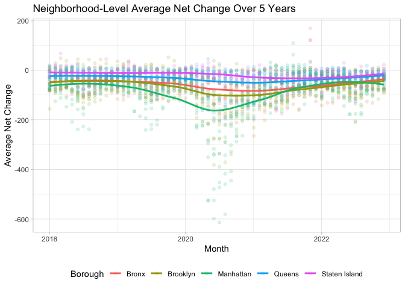

p8105_mtp_xl3214
================
Xuan Lu
2023-10-19

## Report Overview

This project examines NYC ZIP code-level population changes using USPS
Change of Address (COA) data. I cleaned, merged, and performed
exploratory analysis to identify population shifts, investigate data
quality, and reveal demographic trends while addressing dataset
limitations. The raw COA dataset contains 5 variables and 11845
observations, while the raw Zip Codes dataset includes 7 variables and
324 observations.

## Data Wrangling

Data preparation involved importing files and combining sheets in COA.
Column names were cleaned, and new variables (`year` and `net_change` in
COA, `borough` in ZIP) were created. Various joining methods were
compared for data consistency. A `left_join` merged COA and ZIP, warning
many-to-many relationships. Checks were conducted for duplicates in COA
and ZIP. `borough` names were updated, and duplicates for specific zip
codes were addressed.

The final tidy dataset has 10 columns and 11845 rows.

### Variables and examples:

- `year` (numeric): 2018, 2019, 2020, 2021, 2022.
- `month` (POSIXct, POSIXt): 2018-01-01, 2018-02-01, 2018-03-01,
  2018-04-01, 2018-05-01, 2018-06-01.
- `city` (character): NEW YORK, STATEN ISLAND, BRONX, GLEN OAKS, FLORAL
  PARK, LONG ISLAND CITY. There are 78 unique entries.
- `borough` (character): Manhattan, Staten Island, Bronx, Queens,
  Brooklyn. There are 5 unique entries.
- `county_name` (character): New York, Richmond, Bronx, Queens, Kings.
  There are 5 unique entries.
- `neighborhood` (character): Chelsea and Clinton, Lower East Side,
  Lower Manhattan, NA, Gramercy Park and Murray Hill, Greenwich Village
  and Soho. There are 43 unique entries. Additionally, there are 1288
  missing entries in this variable.
- `total_perm_out` (numeric): range 0 to 1772, mean = 267.6287041.
- `total_perm_in` (numeric): range 0 to 1187, mean = 215.7765302.
- `net_change` (numeric): range -983 to 744, mean = -51.8521739.
- `zip_code` (numeric): 1.0001^{4}, 1.0002^{4}, 1.0003^{4}, 1.0004^{4},
  1.0005^{4}, 1.0006^{4}. There are 237 unique entries.

### Data Quality Assessment

#### Table Comparing ‘city’ to ‘borough’

| borough       | BRONX | BROAD CHANNEL | BROOKLYN | BROOKLYN HEIGHTS | FAR ROCKAWAY | ROCKAWAY BEACH | BOWLING GREEN | CANAL STREET | NEW YORK | NYC | ROOSEVELT ISL | ROOSEVELT ISLAND | SECHEDATY | WALL STREET | ARVERNE | ASTORIA | AUBURNDALE | BAYSIDE | BAYSIDE HILLS | BEECHHURST | BELLE HARBOR | BELLEROSE | BELLEROSE MANOR | BREEZY POINT | BRIARWOOD | CALVERTON | CAMBRIA HEIGHTS | CAMBRIA HTS | COLLEGE POINT | CORONA | DOUGLASTON | EAST ELMHURST | ELMHURST | FLORAL PARK | FLUSHING | FOREST HILLS | FRESH MEADOWS | GLEN OAKS | GLENDALE | HOLLIS | HOWARD BEACH | JACKSON HEIGHTS | JACKSON HTS | JAMAICA | KEW GARDENS | KEW GARDENS HILLS | LAURELTON | LITTLE NECK | LONG IS CITY | LONG ISLAND CITY | MASPETH | MIDDLE VILLAGE | MIDDLE VLG | NEPONSIT | NEW YORK CITY | OAKLAND GARDENS | OZONE PARK | QUEENS VILLAGE | QUEENS VLG | REGO PARK | RICHMOND HILL | RIDGEWOOD | ROCKAWAY PARK | ROCKAWAY POINT | ROSEDALE | S OZONE PARK | S RICHMOND HL | SAINT ALBANS | SOUTH OZONE PARK | SOUTH RICHMOND HILL | SPRINGFIELD GARDENS | SPRNGFLD GDNS | ST ALBANS | SUNNYSIDE | WHITESTONE | WOODHAVEN | WOODSIDE | STATEN ISLAND |
|:--------------|------:|--------------:|---------:|-----------------:|-------------:|---------------:|--------------:|-------------:|---------:|----:|--------------:|-----------------:|----------:|------------:|--------:|--------:|-----------:|--------:|--------------:|-----------:|-------------:|----------:|----------------:|-------------:|----------:|----------:|----------------:|------------:|--------------:|-------:|-----------:|--------------:|---------:|------------:|---------:|-------------:|--------------:|----------:|---------:|-------:|-------------:|----------------:|------------:|--------:|------------:|------------------:|----------:|------------:|-------------:|-----------------:|--------:|---------------:|-----------:|---------:|--------------:|----------------:|-----------:|---------------:|-----------:|----------:|--------------:|----------:|--------------:|---------------:|---------:|-------------:|--------------:|-------------:|-----------------:|--------------------:|--------------------:|--------------:|----------:|----------:|-----------:|----------:|---------:|--------------:|
| Bronx         |  1500 |            NA |       NA |               NA |           NA |             NA |            NA |           NA |       NA |  NA |            NA |               NA |        NA |          NA |      NA |      NA |         NA |      NA |            NA |         NA |           NA |        NA |              NA |           NA |        NA |        NA |              NA |          NA |            NA |     NA |         NA |            NA |       NA |          NA |       NA |           NA |            NA |        NA |       NA |     NA |           NA |              NA |          NA |      NA |          NA |                NA |        NA |          NA |           NA |               NA |      NA |             NA |         NA |       NA |            NA |              NA |         NA |             NA |         NA |        NA |            NA |        NA |            NA |             NA |       NA |           NA |            NA |           NA |               NA |                  NA |                  NA |            NA |        NA |        NA |         NA |        NA |       NA |            NA |
| Brooklyn      |    NA |             5 |     2369 |                1 |            6 |             49 |            NA |           NA |       NA |  NA |            NA |               NA |        NA |          NA |      NA |      NA |         NA |      NA |            NA |         NA |           NA |        NA |              NA |           NA |        NA |        NA |              NA |          NA |            NA |     NA |         NA |            NA |       NA |          NA |       NA |           NA |            NA |        NA |       NA |     NA |           NA |              NA |          NA |      NA |          NA |                NA |        NA |          NA |           NA |               NA |      NA |             NA |         NA |       NA |            NA |              NA |         NA |             NA |         NA |        NA |            NA |        NA |            NA |             NA |       NA |           NA |            NA |           NA |               NA |                  NA |                  NA |            NA |        NA |        NA |         NA |        NA |       NA |            NA |
| Manhattan     |    NA |            NA |       NA |               NA |           NA |             NA |             1 |            4 |     3477 |   1 |             4 |                4 |         1 |           1 |      NA |      NA |         NA |      NA |            NA |         NA |           NA |        NA |              NA |           NA |        NA |        NA |              NA |          NA |            NA |     NA |         NA |            NA |       NA |          NA |       NA |           NA |            NA |        NA |       NA |     NA |           NA |              NA |          NA |      NA |          NA |                NA |        NA |          NA |           NA |               NA |      NA |             NA |         NA |       NA |            NA |              NA |         NA |             NA |         NA |        NA |            NA |        NA |            NA |             NA |       NA |           NA |            NA |           NA |               NA |                  NA |                  NA |            NA |        NA |        NA |         NA |        NA |       NA |            NA |
| Queens        |    NA |            NA |       NA |               NA |           96 |             NA |            NA |           NA |       NA |  NA |            NA |               NA |        NA |          NA |      56 |     230 |          2 |     135 |             6 |          4 |           11 |        60 |               2 |           47 |        16 |         1 |              58 |           1 |            60 |     60 |         39 |           117 |       63 |          68 |      309 |           59 |           107 |        52 |       11 |     59 |           60 |              56 |           1 |     372 |          62 |                 4 |        28 |          79 |           19 |              120 |      58 |             58 |          1 |        4 |             1 |              38 |        116 |            165 |          8 |        60 |            54 |        70 |            40 |             13 |       59 |            8 |             9 |           57 |               49 |                  47 |                  30 |             2 |         1 |        51 |         55 |        59 |       59 |            NA |
| Staten Island |    NA |            NA |       NA |               NA |           NA |             NA |            NA |           NA |       NA |  NA |            NA |               NA |        NA |          NA |      NA |      NA |         NA |      NA |            NA |         NA |           NA |        NA |              NA |           NA |        NA |        NA |              NA |          NA |            NA |     NA |         NA |            NA |       NA |          NA |       NA |           NA |            NA |        NA |       NA |     NA |           NA |              NA |          NA |      NA |          NA |                NA |        NA |          NA |           NA |               NA |      NA |             NA |         NA |       NA |            NA |              NA |         NA |             NA |         NA |        NA |            NA |        NA |            NA |             NA |       NA |           NA |            NA |           NA |               NA |                  NA |                  NA |            NA |        NA |        NA |         NA |        NA |       NA |           720 |

The table above (5 observations) reveals data quality issues: ‘New York’
mismatched with both ‘Manhattan’ and ‘Brooklyn,’ indicating inconsistent
city-to-borough relationships. ‘ROOSEVELT ISLAND’ appearing as
‘ROOSEVELT ISL’ in the manhattan_table suggests data transformation
problems. Variations like ‘QUEENS VILLAGE’ and ‘QUEENS VILLAGE, QUEENS’
point to city name inconsistencies. ‘BOWLING GREEN’ and ‘CANAL STREET’
in the ‘city’ variable may signal data entry errors.

#### top 5 most common cities in Manhattan borough

| city             |    n |
|:-----------------|-----:|
| NEW YORK         | 3477 |
| CANAL STREET     |    4 |
| ROOSEVELT ISL    |    4 |
| ROOSEVELT ISLAND |    4 |
| BOWLING GREEN    |    1 |

#### top 5 most common cities in Queens borough

| city           |   n |
|:---------------|----:|
| JAMAICA        | 372 |
| FLUSHING       | 309 |
| ASTORIA        | 230 |
| QUEENS VILLAGE | 165 |
| BAYSIDE        | 135 |

Tables above reaffirmed data quality issues mentioned earlier.

There are 58 ZIP codes with less than 60 observations, and 1288
observations with missing neighborhood data, indicating potential data
gaps due to factors like sparse data collection, inconsistent reporting,
demographic variations, and data source limitations.

## EDA and Visualization

### Average Net Change Table, by year and borough

| borough       |       2018 |      2019 |       2020 |      2021 |      2022 |
|:--------------|-----------:|----------:|-----------:|----------:|----------:|
| Bronx         | -46.303333 | -48.01667 |  -72.65333 | -66.10000 | -53.19000 |
| Brooklyn      | -46.184265 | -51.68323 | -110.67206 | -76.83811 | -55.37759 |
| Manhattan     | -41.967422 | -52.78477 | -126.43461 | -38.97550 | -46.58806 |
| Queens        | -26.640479 | -29.29128 |  -48.28437 | -45.37178 | -30.77854 |
| Staten Island |  -9.846154 |  -9.12500 |  -10.54483 | -22.54861 | -16.29861 |

The table reveals trends in average net change by borough and year.
Annual fluctuations, particularly significant decreases in 2020, are
observed. Brooklyn consistently exhibits the highest negative average
net change, contrasting with Staten Island’s stability. The Bronx and
Queens display varying average net change, reflecting population
fluctuations, possibly influenced by the COVID-19 pandemic in 2020.
These trends may stem from demographic shifts and housing patterns.

### Five lowest values of net change across all observed data

| zip_code | neighborhood                  | year | month | net_change |
|---------:|:------------------------------|-----:|------:|-----------:|
|    10022 | Gramercy Park and Murray Hill | 2020 |     5 |       -983 |
|    10009 | Lower East Side               | 2020 |     7 |       -919 |
|    10016 | Gramercy Park and Murray Hill | 2020 |     6 |       -907 |
|    10016 | Gramercy Park and Murray Hill | 2020 |     7 |       -855 |
|    10009 | Lower East Side               | 2020 |     6 |       -804 |

### Five highest values of net change before 2020

| zip_code | neighborhood        | year | month | net_change |
|---------:|:--------------------|-----:|------:|-----------:|
|    11101 | Northwest Queens    | 2018 |     4 |        360 |
|    11101 | Northwest Queens    | 2018 |     6 |        344 |
|    11101 | Northwest Queens    | 2018 |     5 |        300 |
|    10001 | Chelsea and Clinton | 2018 |     7 |        225 |
|    11201 | Northwest Brooklyn  | 2018 |     4 |        217 |

### Trend plot of neighborhood-level average net change by month

<!-- -->

Neighborhood-Level average net change is mostly below zero across all
boroughs, over 5 years. The mean net change is -51.8521739. Overall,
Manhattan has the lowest average net change, Staten Island has the
highest. Average net change is stable in 2018, 2019, and 2022. However,
a substantial drop occurred between 2020 and 2021, especially in
Manhattan.

## Limitations

The dataset has many limitations, including data quality issues, borough
mismatches, many-to-many relationships, limited time range, local
influences, and potential seasonal patterns. It lacks demographic and
socioeconomic data. Thorough preprocessing and data integration are
needed for a holistic view of population changes.

| Method          | koRpus      | stringi       |
|:----------------|:------------|:--------------|
| Word count      | 505         | 499           |
| Character count | 3655        | 3655          |
| Sentence count  | 57          | Not available |
| Reading time    | 2.5 minutes | 2.5 minutes   |
